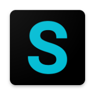
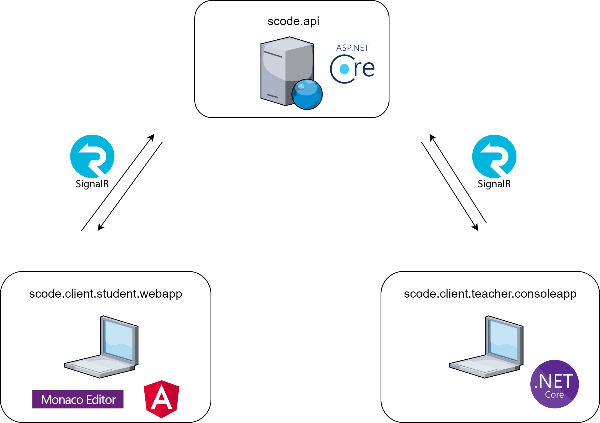

## ¿Qué es SCode?
SCode es un proyecto de código abierto, que permite la sincronización de un directorio de archivos de texto en tiempo real con un cliente web.

Nace para resolver los problemas que tiene un docente de programación, a la hora de compartir el código que escribe en su equipo con sus alumnos.

https://github.com/joseavilees/SCode/assets/57925314/f5ae5945-9cec-4be5-9c37-d04d98c557e7

## ¿Cómo funciona?
SCode sincroniza los cambios realizados sobre un directorio una vez que estos archivos se guardan. Para mantener los cambios siempre sincronizados se puede configurar el auto-guardado del IDE para que guarde los cambios cada segundo.

SCode funciona mediante tres aplicaciones:

* **SCode.Api:** Aplicación web desarrollada en *ASP.NET 5* al que se conecta tanto los estudiantes como el docente, mediante SignalR *(websocket)*, para publicar o recibir cambios de archivos.

* **SCode.Client.Teacher.ConsoleApp:** Aplicación de consola desarrollada en *.NET 5*, usada por el docente para publicar los cambios que se realizan sobre el directorio al servidor *scode.api*.
Es necesario autentificarse contra el servidor con una *API-KEY*. Al iniciar la sesión es necesario indicarle el nombre de la sala y la ruta del directorio.

* **SCode.Client.Student.WebApp:** Aplicación web desarrollada en *Angular*, usada por los estudiantes para recibir los cambios que se realizan sobre el directorio.
Es necesario indicar el nombre de la sala a la que se quiere conectar. No requiere autentificación.

### Colaborar
No dudes en contactar conmigo si quieres colaborar, reportar fallos o aportar ideas :)
